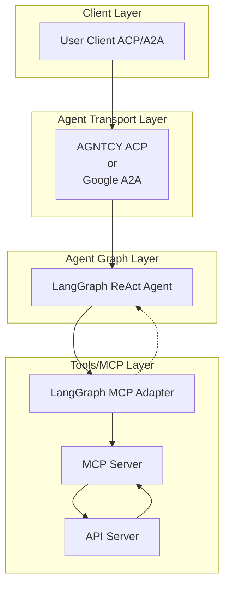

# 🚀 Jarvis Multi-Agent System

---

## 🧪 Evaluation Badges

| Claude | Gemini | OpenAI | Llama |
|--------|--------|--------|-------|
|  |  |  |  |

---

- 🤖 **Jarvis Multi-Agent System** is an LLM-powered agent built using the [LangGraph ReAct Agent](https://langchain-ai.github.io/langgraph/agents/agents/) workflow and [MCP tools](https://modelcontextprotocol.io/introduction).
- 🌐 **Protocol Support:** Compatible with [ACP](https://github.com/agntcy/acp-spec) and [A2A](https://github.com/google/A2A) protocols for integration with external user clients.
- 🛡️ **Secure by Design:** Enforces API token-based RBAC and supports external authentication for strong access control.
- 🔌 **Integrated Communication:** Uses [langchain-mcp-adapters](https://github.com/langchain-ai/langchain-mcp-adapters) to connect with the MCP server within the LangGraph ReAct Agent workflow.
- 🏭 **First-Party MCP Server:** The MCP server is generated by our first-party [openapi-mcp-codegen](https://github.com/cnoe-io/openapi-mcp-codegen/tree/main) utility, ensuring version/API compatibility and software supply chain integrity.

---

## 🏗️ Architecture

---

## ✨ Features

- 🤖 **LangGraph + LangChain MCP Adapter** for agent orchestration
- 🧠 **Azure OpenAI GPT-4o** as the LLM backend
- 🔗 Connects to external systems via a dedicated MCP agent
- 🔄 **Multi-protocol support:** Compatible with both **ACP** and **A2A** protocols for flexible integration and multi-agent orchestration

---

## 📜 License

Apache 2.0 (see [LICENSE](./LICENSE))

---

## 👥 Maintainers

See [MAINTAINERS.md](MAINTAINERS.md)

- Contributions welcome via PR or issue!

---

## 🙏 Acknowledgements

- [LangGraph](https://github.com/langchain-ai/langgraph) and [LangChain](https://github.com/langchain-ai/langchain) for agent orchestration frameworks.
- [langchain-mcp-adapters](https://github.com/langchain-ai/langchain-mcp-adapters) for MCP integration.
- [AGNTCY Agent Connect Protocol(ACP)](https://docs.agntcy.org/pages/syntactic_sdk/connect.html)
- [Google A2A](https://github.com/google/A2A/tree/main)
- [Model Context Protocol (MCP)](https://modelcontextprotocol.io/) for the protocol specification.
- The open source community for ongoing support and contributions.

